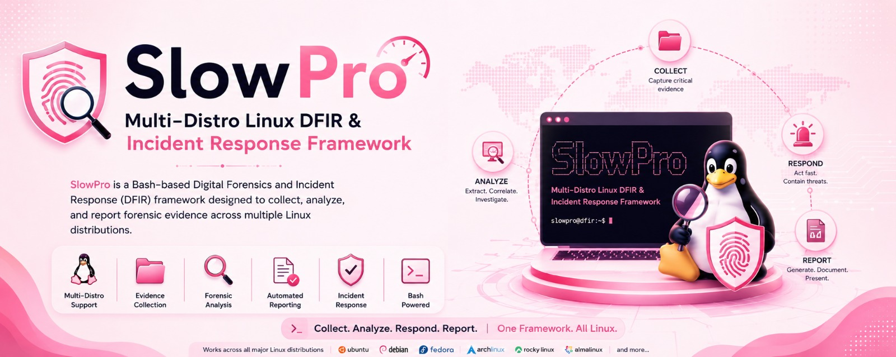

# SlowPro 🐢

Developed by **Pranjal Shridhar Verma**

**Multi-Distro Linux DFIR Framework**


SlowPro is a lightweight Linux Digital Forensics and Incident Response (DFIR) framework written entirely in Bash.

It automates evidence collection, integrity verification, IOC detection, threat scoring, timeline generation, HTML reporting, and snapshot comparison across multiple Linux distributions.

---

## Features

### Evidence Collection

* Host information collection
* User enumeration
* Running process collection
* Network connection collection
* Service enumeration
* Installed package collection
* Collection metadata generation

### Analysis

* IOC Detection
* Threat Scoring
* Timeline Reconstruction
* Snapshot Comparison

### Reporting

* HTML Investigation Report
* IOC Report
* Timeline Report
* Threat Score Report

### Integrity

* SHA256 hashing of collected evidence

### Multi-Distro Support

Supported distributions:

* Ubuntu
* Debian
* Kali Linux
* RHEL
* Rocky Linux
* AlmaLinux
* Arch Linux

---

# Project Structure

```text
SlowPro/
├── adapters/
├── analyzers/
├── assets/
├── cases/
├── collectors/
├── commands/
├── core/
├── data/
├── docs/
├── reports/
├── tests/
└── slowpro.sh
```

---

# Requirements

* Bash
* sudo privileges
* Linux environment

Recommended:

* Ubuntu
* Kali Linux
* WSL2
* RHEL-based systems

---

# Installation

Clone repository:

```bash
git clone https://github.com/PranjalShridhar316/SlowPro.git
cd SlowPro
```

Make executable:

```bash
chmod +x slowpro.sh
```

---

# Running SlowPro

Launch a new investigation:

```bash
sudo ./slowpro.sh
```

Example:

```bash
sudo ./slowpro.sh
```

Output:

```text
[INFO] Creating investigation case...
[SUCCESS] Case created:
cases/CASE_2026-06-14_04-03-56
```

---

# Investigation Cases

List available cases:

```bash
ls cases
```

Latest case:

```bash
LATEST=$(ls -td cases/CASE_* | head -1)

echo "$LATEST"
```

---

# Viewing Collected Evidence

View case structure:

```bash
tree "$LATEST"
```

View artifacts only:

```bash
tree "$LATEST/artifacts"
```

---

## Host Information

```bash
cat "$LATEST/artifacts/host/host.json"
```

---

## Users

```bash
cat "$LATEST/artifacts/users/users.json"
```

First 10 entries:

```bash
head "$LATEST/artifacts/users/users.json"
```

---

## Processes

```bash
cat "$LATEST/artifacts/processes/processes.json"
```

First 10 entries:

```bash
head "$LATEST/artifacts/processes/processes.json"
```

---

## Network Connections

```bash
cat "$LATEST/artifacts/network/network.txt"
```

---

## Services

```bash
cat "$LATEST/artifacts/services/services.txt"
```

---

## Installed Packages

```bash
cat "$LATEST/artifacts/packages/packages.txt"
```

---

# Integrity Verification

View evidence hashes:

```bash
cat "$LATEST/integrity/hashes.txt"
```

Example:

```text
SHA256 HASH -> host.json
SHA256 HASH -> users.json
SHA256 HASH -> processes.json
```

---

# IOC Analysis

View IOC report:

```bash
cat "$LATEST/analysis/ioc_report.txt"
```

Example:

```text
==================================
      SlowPro IOC Report
==================================

[Suspicious Users]

[Suspicious Processes]

[Suspicious Ports]
```

---

# Threat Scoring

View threat score:

```bash
cat "$LATEST/analysis/threat_score.txt"
```

---

# Timeline Reconstruction

View timeline:

```bash
cat "$LATEST/analysis/timeline.txt"
```

Example:

```text
Case Created
Host Collection Completed
IOC Analysis Completed
Threat Scoring Completed
```

---

# Collection Metadata

View collection metadata:

```bash
cat "$LATEST/analysis/collection_metadata.json"
```

---

# HTML Report

Generate report automatically during execution.

Open latest report:

```bash
LATEST=$(ls -td cases/CASE_* | head -1)

cmd.exe /c start "$(wslpath -w "$LATEST/reports/report.html")"
```

---

# Snapshot Comparison

Compare two investigations:

```bash
sudo ./slowpro.sh --compare \
cases/CASE_1 \
cases/CASE_2
```

Example:

```bash
sudo ./slowpro.sh --compare \
cases/CASE_2026-06-14_02-27-21 \
cases/CASE_2026-06-14_02-56-54
```

Output:

```text
==================================
   SlowPro Comparison Report
==================================

[New Users]

[New Processes]
/usr/lib/polkit-1/polkitd

[New Listening Ports]
```

---

# Output Locations

```text
cases/
└── CASE_xxxxx
    ├── analysis/
    ├── archive/
    ├── artifacts/
    ├── integrity/
    └── reports/
```

---

# Roadmap

## Version 1.1

* Authentication Log Analysis
* Failed Login Detection
* SSH Activity Tracking
* IOC Feed Integration

## Version 1.2

* MITRE ATT&CK Mapping
* YARA Rule Scanning
* Sigma Rule Support

## Version 2.0

* Memory Collection
* Container Forensics
* Live Response Modules
* PDF Reporting

---

# License

MIT License

---

# Author

**Pranjal Shridhar Verma**

Student |Linux Administrator | RHCSA Candidate | Cybersecurity Enthusiast

SlowPro was developed as a hands-on Digital Forensics and Incident Response (DFIR) project to strengthen practical skills in:

* Linux Administration
* Bash Scripting
* Incident Response
* Threat Hunting
* Digital Forensics
* Security Automation

The project focuses on building DFIR capabilities using native Linux tools and Bash while maintaining compatibility across multiple Linux distributions.


